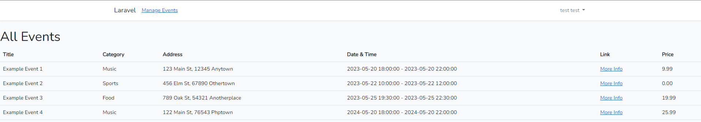
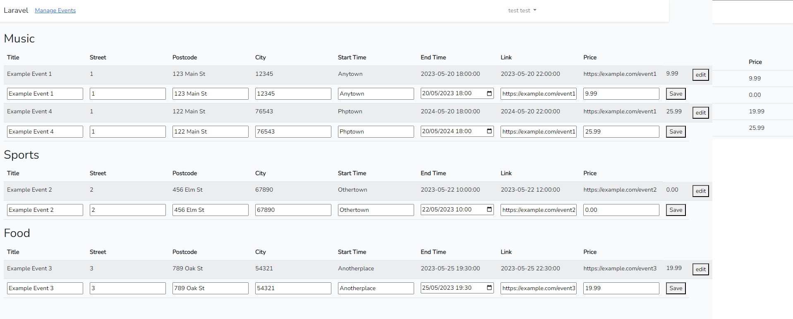
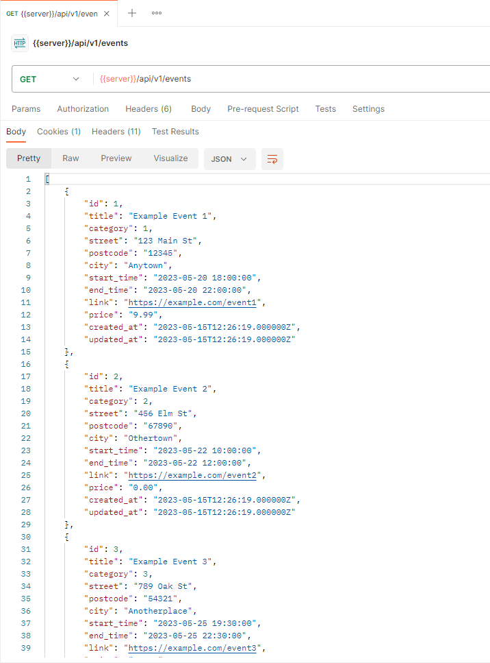
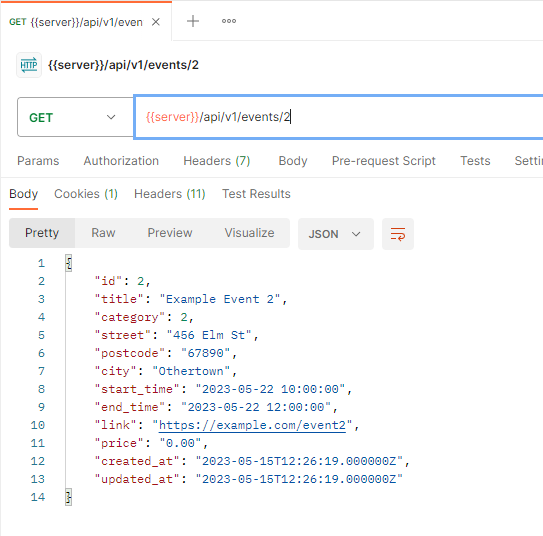

# Deutch:

## Wie man das Projekt startet

Normalerweise würde ich ein Projekt dockerisieren, aber aufgrund von mein Hardware musste ich es
old-school machen (sorry).

- Datenbank erstellen - `php artisan db:create your_database_name`
- Stelle sicher, dass deine `.env` die richtige Datenbank-Name hat
- Migrationen ausführen - `php artisan migrate`
- Seeders für Beispieldaten ausführen - `php artisan db:seed --class=CategorySeeder`
  & `php artisan db:seed --class=EventsSeeder`

## Du solltest jetzt sehen:

- auf '/':
  
  zeigt eine Liste aller Mock-Events
- wenn du dich einloggst und auf "Veranstaltungen verwalten" klickst, gelangst du in den privaten Bereich,
- in dem du die Veranstaltungen verwalten kannst:
  
  Diese Seite ist noch nicht ganz fertig, also erkläre ich ein wenig:
    - Du siehst eine Auflistung aller Kategorien, und alle Veranstaltungen sind unter diesen Kategorien sortiert.
    - Die Zeilen mit bearbeitbaren Feldern sollten anfangs ausgeblendet sein. Sobald die Funktion vollständig
      funktioniert, sollte sie nur dann angezeigt werden, wenn du auf "Bearbeiten" klickst. Dann könntest
      du Änderungen an diesen Feldern vornehmen und nach dem Klicken auf "Speichern" wird das Formular übermittelt,
      die Änderungen gespeichert und du wirst zurück zur gleichen Seite geleitet, die mit neuen Daten neu geladen wird.
      Ich hatte ein Problem mit dem Absenden des Formulars am Ende, aber ich hatte keine Zeit
      mehr, es zu beheben. Trotz
      ist die Route eingestellt und der Service ist auch bereits erstellt.
    - Ich habe es zeitlich nicht geschafft, die Bearbeitung von Kategorien umzusetzen. ¯\\_(ツ)_/¯
- Die beiden API-Endpunkte sollten wie folgt aussehen:
  
  

# English:

## How to get the project going

normally I would send a project dockerised but because of hardware changes I had to do it old school (sorry)

- create db - `php artisan db:create your_database_name`
- make sure you `.env` has the right db name
- run migrations - `php artisan migrate`
- run seeders for sample
  data - `php artisan db:seed --class=CategorySeeder` & `php artisan db:seed --class=EventsSeeder`

## you should now see:

- at '/':
  
  showing a list of all the mock events
- if you log in and click on Manage Events you will go to the private area where you can manage the events:
  
  this page is not quite finished, so I'll explain a little:
    - you see a listing of all category and all events are sorted under those categories.
    - the rows with editable fields should be hidden initially once the feature fully works and only show if you click
      on 'Edit'. Then you would be able to make changes to those fields and after pressing 'Save' the form is submitted,
      changes saved and you are redirected back to the same page which reloads with the new data.
      I had issue with the form sending at the end but I ran out of time to fix it. Despite
      that Route is set and the Service is also done.
    - I did not manage time-wise to implement editing of categories. ¯\\_(ツ)_/¯
- the two API endpoints should look like this:
  
  
